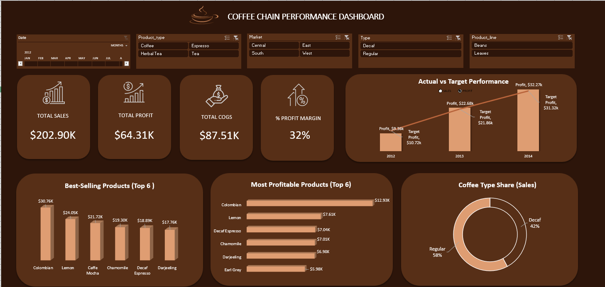
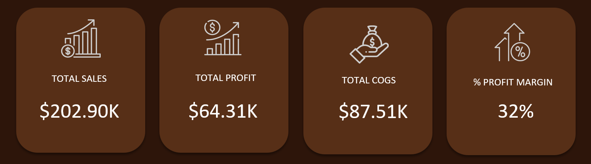
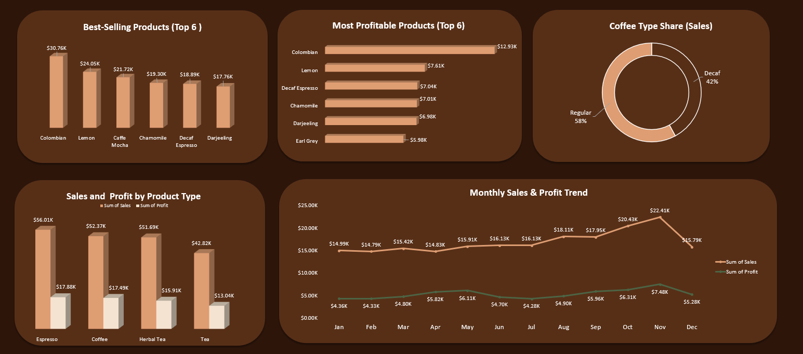
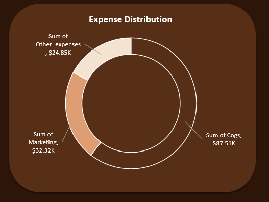

# Coffee Chain Performance Analysis Dashboard

## Project Overview
In the competitive retail coffee industry, understanding sales, profit, and expenses is crucial for growth.  
This project analyzes a coffee chain’s performance using Excel, transforming raw sales data into actionable insights for business decisions.

The **Coffee Chain Performance Analysis Dashboard** enables stakeholders to evaluate performance across products, markets, and time periods, highlighting trends, profitability, and opportunities for optimization.

---

## Dataset
The dataset contains sales records over multiple years, including key columns such as:

- Date, Product, Coffee Type (Regular/Decaf), Market, Product Line  
- Financial metrics: Sales, Profit, Cost of Goods Sold (COGS), Other Expenses  

> Derived metrics like **Net Margin** and **Profit Margin** were added to enhance analysis.

---

## Tools & Techniques
- **Microsoft Excel:** Pivot Tables, Charts, KPIs  
- **Data Cleaning & Transformation:** Standardized product names, created custom metrics  
- **Visualization:** Interactive slicers and charts for dynamic exploration of trends

---

## Key Features
- **Interactive Slicers:** Filter by Date, Product, Market, Coffee Type, and Product Line  
- **Custom Metrics:** Net Margin, Gross Margin, Other Expenses  
- **Core KPIs:**
  - Total Sales: $202.90K  
  - Total Profit: $64.31K  
  - Total COGS: $87.52K  
  - Profit Margin: 32%

---

## Performance Highlights
- 2012: Sales $38.51K vs target $30.42K | Profit $9.36K  
- 2013: Sales $68.50K vs target $58.76K | Profit exceeded target  
- 2014: Sales $96.33K vs target $89.76K | Profit exceeded target  

> Demonstrates consistent growth in sales and profitability over three years.

---

## Insights & Analysis
- **Top-Selling Products:** Colombian Coffee ($30.76K), Lemon flavor ($24.05K)  
- **Most Profitable Products:** Colombian Coffee ($12.93K), Lemon, Decaf Espresso  
- **Category Performance:** Espresso leads in both sales and profit; Tea lags behind  
- **Monthly Trends:** November is the peak month for sales ($22.41K) and profit ($7.48K); February the lowest ($14.79K)  
- **Geographic Performance:** California top-performing ($23.03K), New Hampshire lowest ($3.54K)  
- **Expense Insights:** COGS ($87.51K), Marketing ($32.32K), Other Expenses ($24.55K) — visuals highlight cost impact on profitability

---

> Dashboard provides actionable insights to support strategic decision-making and profitability optimization.

---

## Screenshots

1. **Dashboard Overview**  

2. **KPI Charts**  

3. **Product & Market Insights**  

---

## Key Learnings
- Built interactive dashboards to explore business performance  
- Applied data cleaning, transformation, and metric creation  
- Learned to present actionable insights in a business-friendly format  

