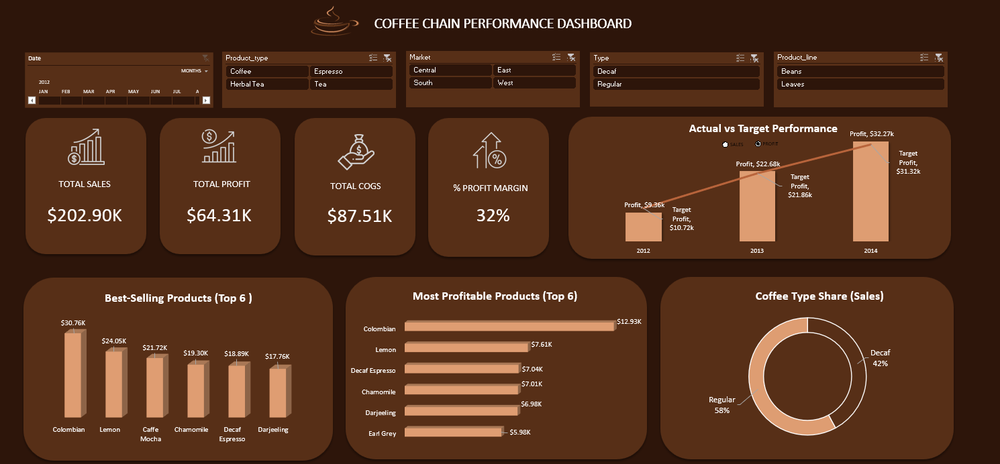

# Coffee Chain Performance Analysis Dashboard

## Project Overview
In the competitive retail coffee industry, understanding sales, profit, and expenses is crucial for growth.  
This project analyzes a coffee chain’s performance using Excel, transforming raw sales data into actionable insights for business decisions.

The **Coffee Chain Performance Analysis Dashboard** enables stakeholders to evaluate performance across products, markets, and time periods, highlighting trends, profitability, and opportunities for optimization.

---

## Dataset

The data contains order-level details covering:
* **Orders:** Order Date, Product Type, Coffee Type (Regular/Decaf), Product Line, Quantity, Sales, Profit, COGS  
* **Markets & Geography:** Market, State  
* **Metrics:** Total Sales, Total Profit, Total COGS, Profit Margin, Other Expenses  

## Tools & Techniques
* **Microsoft Excel:** Pivot Tables, Charts, KPIs  
* **Data Cleaning & Transformation:** Standardized product names, created custom metrics  
* **Visualization:** Interactive slicers and charts for dynamic exploration of trends
* **Custom Metrics:** Calculated fields for Net Margin, Gross Margin, and Other Expenses to enrich analysis  

---

## Key KPIs

* **Total Sales:** $202.90K  
* **Total Profit:** $64.31K  
* **Total COGS:** $87.52K  
* **Profit Margin:** 32%  

---

## Insights & Analysis

**Performance Patterns** 

The dashboard shows how the coffee chain performed over three years:

* **2012:** Sales $38.51K vs. target $30.42K; Profit $9.36K vs. $10.76K  
* **2013:** Sales $68.50K vs. target $58.76K; Profit steadily exceeded targets  
* **2014:** Sales $96.33K vs. target $89.76K; Profit continued to improve
  
The chain consistently met sales expectations, and profits improved year over year

**Product & Category Patterns**  

* **Top-Selling Products:** Colombian Coffee ($30.76K) and Lemon flavor ($24.05K)  
* **Most Profitable Products:** Colombian Coffee ($12.93K profit), followed by Lemon and Decaf Espresso  
* **Category Observations:** Espresso generated the highest sales ($58.01K) and profit ($17.88K), while Tea lagged ($42.82K sales, $13.04K profit)  

**Market & Seasonal Trends**  

* **Coffee Type Share:** Regular coffee made up 58% of total sales, Decaf 42%
* **Monthly Trends:**  
  * Peak Month: November ($22.41K sales, $7.48K profit)  
  * Lowest Month: February ($14.79K sales, $4.33K profit)  
* **Geographic Performance:** California was the top-performing state ($23.03K sales), while New Hampshire recorded the lowest ($3.54K)
  
* Strong seasonal demand and state-level differences highlight opportunities for targeted promotions and inventory planning.

**Expense Patterns**  

* **COGS:** $87.51K  
* **Marketing:** $32.32K  
* **Other Expenses (Custom Metric):** $24.55K  
* The expense breakdown clarified how marketing and operational costs affected profitability.  

**Segment Performance**  

* **Coffee Types:** Regular coffee contributes more to total revenue, but Decaf maintains steady profitability.  
* **Product Lines:** High-margin lines, such as Colombian Coffee and Espresso, consistently outperform others.  
* Understanding segment and product-level contributions helps optimize marketing and pricing strategies.

---
## Screenshots

1. **Dashboard Overview**  

2. **KPI Charts**  

3. **Product & Market Insights**  

  
---

## Key Learnings
- Built interactive dashboards to explore business performance  
- Applied data cleaning, transformation, and metric creation  
- Learned to present actionable insights in a business-friendly format  

