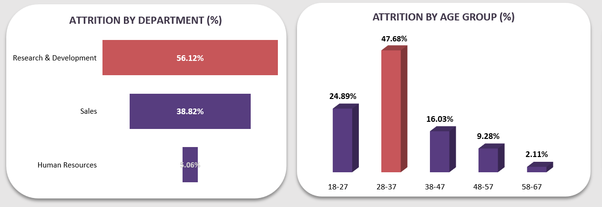

# HR Analytics Dashboard – Unlocking Workforce Insights

## Project Overview

Employee retention and workforce management are critical for organizational success.  
This project analyzes HR data using Excel to uncover trends in **employee demographics, attrition, tenure, and overtime**, providing actionable insights for HR strategy and decision-making.

The **HR Analytics Dashboard** allows stakeholders to explore workforce dynamics, identify retention risks, and optimize resource allocation.

---

## Dataset

The dataset contains employee records with key fields:

* Employee ID, Age, Gender, Department, Job Role, Tenure, Attrition, Overtime  
* Additional derived metrics: **Attrition Rate**, **Average Tenure**, **Employees Working Overtime**

> Data was cleaned and standardized for accurate analysis.

---

## Tools & Techniques

* **Microsoft Excel:** Pivot Tables, Charts, KPIs  
* **Data Cleaning & Transformation:** Standardized values, created derived metrics  
* **Visualization:** Interactive slicers and charts to explore trends across departments, age groups, and job roles

---

## Key Features

* **Interactive Slicers:** Filter by Department, Age Group, Gender, Job Role  
* **Core KPIs:**  
  - Total Employees: 1,470  
  - Attrition Rate: 16%  
  - Average Tenure: 7 years  
  - Employees Working Overtime: 28.3%

---

## Insights & Analysis

* **Attrition Trends:**  
  - Highest in 28–37 age group (47.7%), followed by 18–27 (24.9%)  
  - Employees working overtime showed **3x higher attrition** than non-overtime staff  

* **Department & Role Insights:**  
  - Research & Development: 56.1% of attrition  
  - Sales: 38.8% of attrition  
  - Lab Technicians and Sales Executives face highest attrition rates  

* **Tenure Analysis:**  
  - Attrition is **highest in first 4 years (59.5%)**, sharply decreasing after year 5  

> Insights reveal early-career employees and high-pressure roles are at the greatest retention risk.

---

 

> Dashboard turns raw HR data into actionable decisions, helping HR leaders retain talent and improve workforce stability.

---

## Screenshots

1. **Dashboard Overview**  
   

2. **Attrition Analysis by Age & Department**  
   

3. **Tenure & Overtime Patterns**  
   

---

## Key Learnings

* Built interactive Excel dashboards to explore HR data  
* Applied data cleaning, transformation, and KPI creation  
* Presented actionable insights in a business-friendly format  

