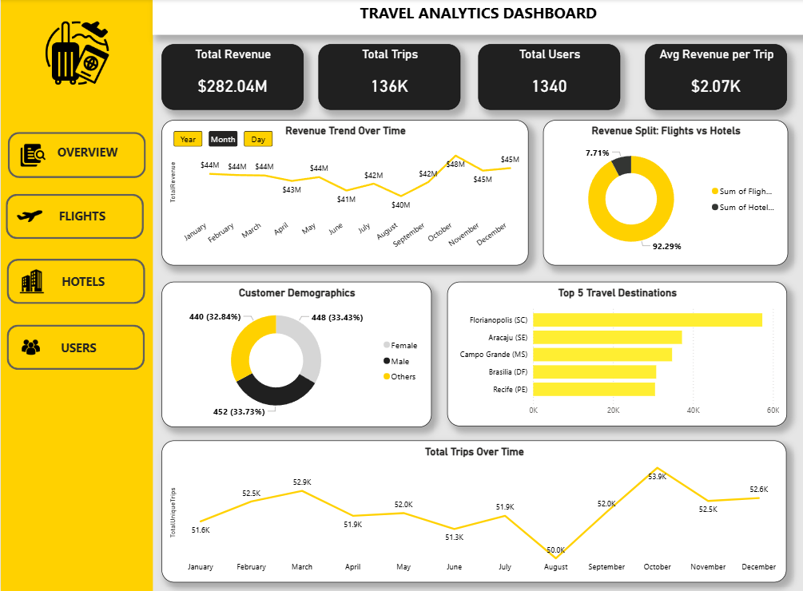
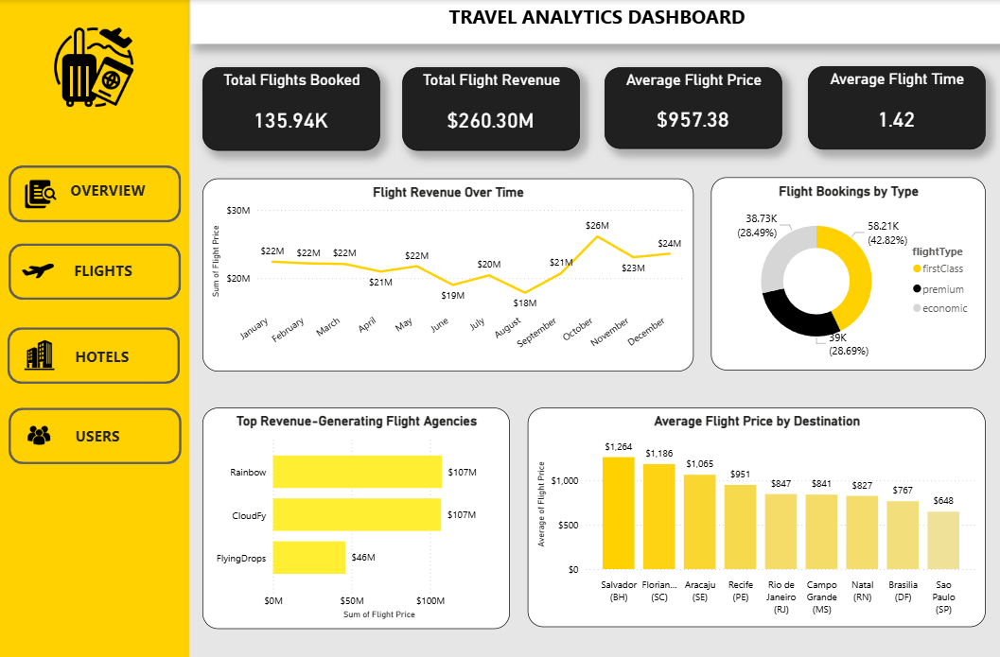
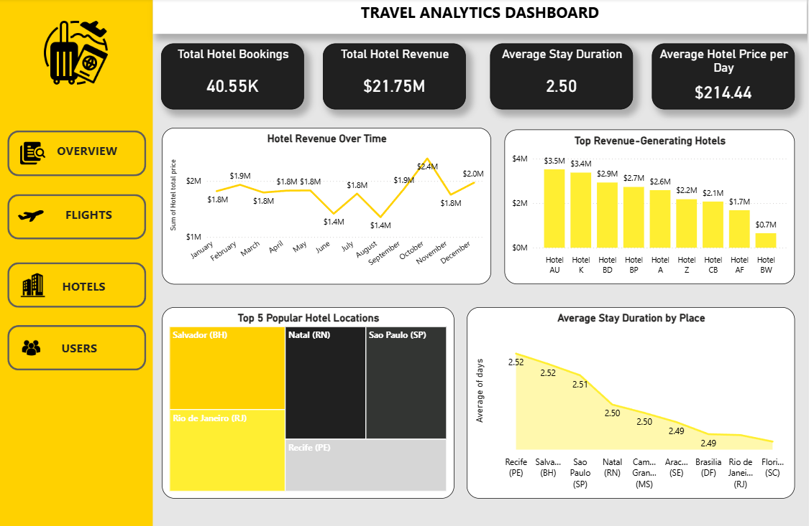
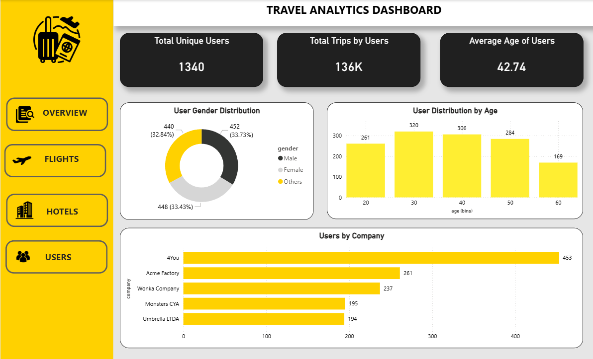

# Travel Analytics Dashboard – Power BI Portfolio Project

## Project Overview

The travel industry relies heavily on understanding visitor trends, booking patterns, and revenue streams.  
This project uses **Power BI** to analyze travel data, transforming raw records into actionable insights that help stakeholders optimize operations, enhance customer experiences, and identify high-performing regions.

The **Travel Analytics Dashboard** provides interactive visualizations to monitor KPIs, seasonal trends, and customer behavior patterns.

---

## Dataset

The dataset contains records related to:

* Visitor demographics: Age, Gender  
* Booking & travel details: Destination, Travel Dates, Mode of Travel  
* Financial metrics: Booking Amount, Revenue  
* Derived metrics: Total Revenue, Trips per User, Average Revenue per Trip

> The data was cleaned, standardized, and transformed to ensure accurate analysis in Power BI.

---

## Tools & Techniques

* **Power BI Desktop:** Data modeling, DAX measures, interactive dashboards  
* **Data Transformation:** Cleaning, calculated columns, derived metrics using Power Query  
* **Visualization & Interaction:** Action filters (clickable visuals for cross-filtering), dynamic KPIs, bar and line charts to explore trends  
* **Data Relationships:** Tables linked to enable cross-analysis of trips, revenue, and user behavior

---

## Key Features

* **Dynamic KPIs:**  

  * Total Trips: 136,000  
  * Total Revenue: $282.04M  
  * Total Users: 1,340  
  * Average Revenue per Trip: $2.70K  

* **Relationships Across Tables:** Flights, Hotels, and Users tables are connected for cross-analysis, enabling comprehensive insights across multiple data sources  

---

## Insights & Analysis

### Overall Performance
The dashboard shows a total revenue of **$282.04M** generated from **136,000 trips** by **1,340 users**, averaging **$2.70K per trip**. Flights dominate revenue (**92.29%**), while hotels contribute **7.71%**. Revenue peaked in **2020 at $129M** and dropped to **$28M in 2023**, with **October** consistently the busiest month.

### Traveler Demographics
Visitor gender distribution is balanced: Male 33.73%, Female 33.43%, Others 32.84%. The majority of travelers are aged **30–50 years**, highlighting this segment as the core target for marketing and engagement.

### Flight Insights
A total of **135,940 flights** were booked, generating **$260.30M**. First Class accounted for **42.82%** of bookings. Peak revenue occurred in **2020**, with October as the top month and August the lowest. Top-performing agencies include Rainbow ($107M), CloudFly ($107M), and FlyingDrops ($46M).

### Hotel Insights
**40,550 hotel bookings** contributed **$21.75M** in revenue. The average stay is **2.5 days**, with an average daily spend of **$214.40**. Revenue peaked in **2020** with October as the top month. Popular hotel locations include Salvador (BH), Sao Paulo (SP), Rio de Janeiro (RJ), Natal (RN), and Recife (PE).

### Trip & Seasonal Trends
Trips mirror revenue trends, peaking in **October** and lowest in **August**. Coastal destinations generate the most revenue, while mountain regions show steady, moderate growth.

### User Behavior
Users aged **30–50 years** take the majority of trips. Analysis of booking channels shows that **online portals drive most reservations**, while direct bookings yield higher revenue per visitor.

---

## Key Learnings

* Built an interactive Power BI dashboard   
* Applied data transformation and created dynamic DAX measures  
* Communicated insights through clear, engaging visualizations  
* Converted raw travel data into actionable business decisions

---

## Screenshots

1. **Dashboard Overview**  
   

2. **Flights Analysis**  
   

3. **Hotels Analysis**  
   

4. **Users Analysis**  
   

