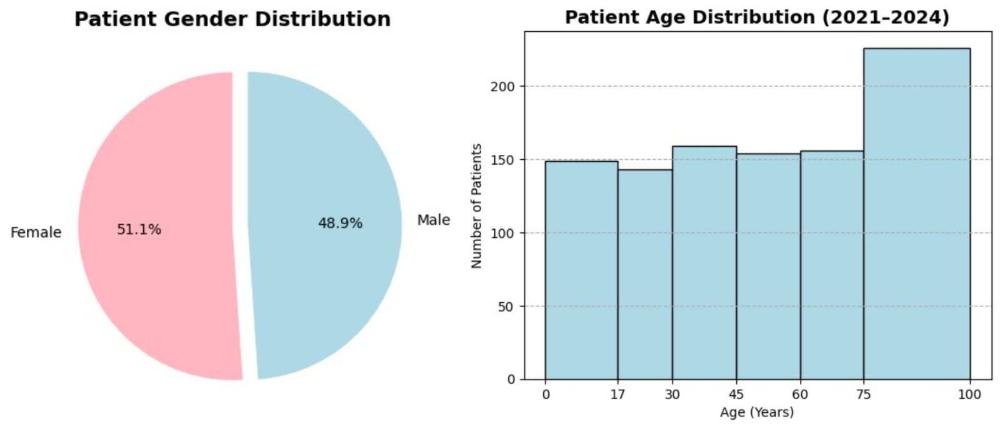
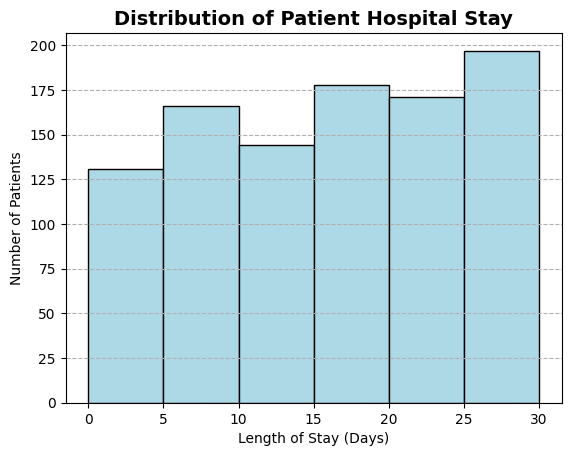
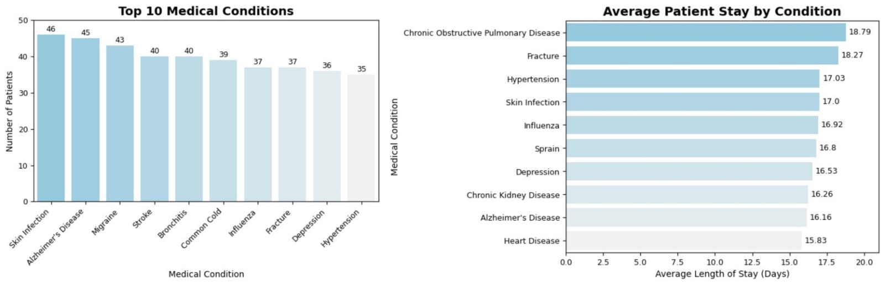
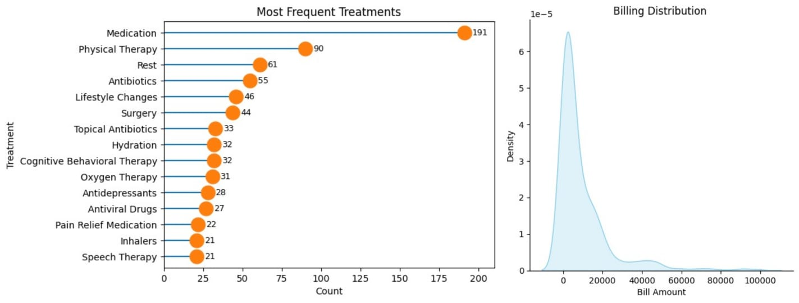
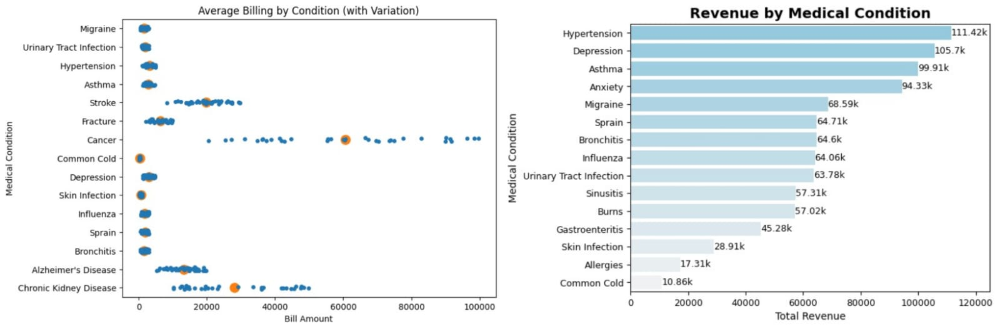
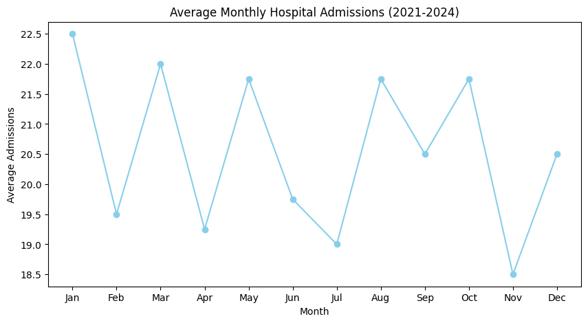
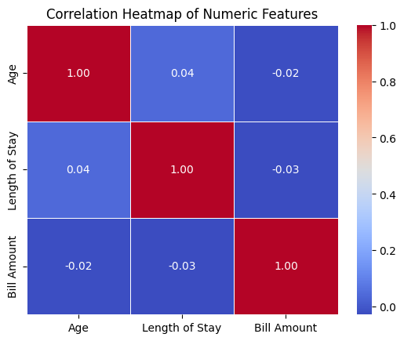

# Hospital Data Analysis – Uncovering Patient Trends

## Project Overview

Hospitals generate vast amounts of data daily, from patient admissions to treatments and billing records. Proper analysis of this data can reveal patterns that improve patient care, optimize resource allocation, and support financial planning.

This project explores a hospital dataset to uncover trends in **patient demographics, hospital stays, treatments, and billing patterns**, transforming raw records into actionable insights that inform operational and strategic decisions.

---

## Dataset and Data Cleaning

The dataset contains patient information, clinical details, hospitalization records, and billing data.  

During preparation, data inconsistencies were addressed: duplicate records were removed, and date columns were converted to datetime format for accurate calculations. Patient age was calculated from date of birth, and invalid entries were filtered out. The length of stay (LOS) was computed from admit and discharge dates, enabling deeper analysis of hospital utilization and patient flow.

Key metrics calculated include:

* Total Patients Admitted: 987  
* Gender Split: Female 51.06%, Male 48.94%  
* Average Patient Age: 49 years  
* Average Length of Stay (LOS): 15.6 days  
* Total Billing Amount: $9.46M  

---

## Tools & Techniques

* **Python:** Data cleaning and analysis using Pandas  
* **Matplotlib & Seaborn:** Visualizations for trends and patterns  
* **Derived Metrics:** Age, Length of Stay, Billing totals, Gender proportions  

---

## Insights

Patients were almost evenly split between male and female (48.94% vs 51.06%).Age distribution showed that patients ranged from 0 to 100 years, with an average age of 49 years. The majority of admissions were concentrated in the 75–100 year range, highlighting that older adults represent a significant portion of hospital patients.
  

The majority of patients had a Length of Stay (LOS) between 15–30 days, with the highest number of patients in the 25–30 day range , highlighting extended care requirements for critical cases.

  

Skin Infection was the most frequent condition, while cancer cases contributed significantly to overall billing. The top ten conditions had average stays of 16–19 days, indicating consistent hospitalization needs across common medical issues.
  

Medication was the most frequent treatment type, reflecting its central role in patient care. Billing distribution showed most patients were billed 0–20,000, with a smaller number of high-value cases that significantly impact hospital revenue.

  

Most treatments cost between 0–50,000, but cancer treatments were higher, ranging from 20,000–100,000. Hypertension generated the highest revenue, whereas common cold contributed the least, highlighting chronic conditions as the biggest financial drivers.

  

Admissions were relatively steady throughout the year, with slight peaks in January and March and minor dips in November.

Correlation analysis revealed weak relationships among age, length of stay, and billing, indicating that treatment type and condition severity primarily drive costs rather than patient age or stay duration.

 

---

## Key Learnings

* Transformed raw hospital data into actionable insights  
* Highlighted trends in patient demographics, hospitalization, treatment patterns, and billing  
* Demonstrated the importance of combining **data cleaning, metrics, and visualization** to produce meaningful insights  

---

