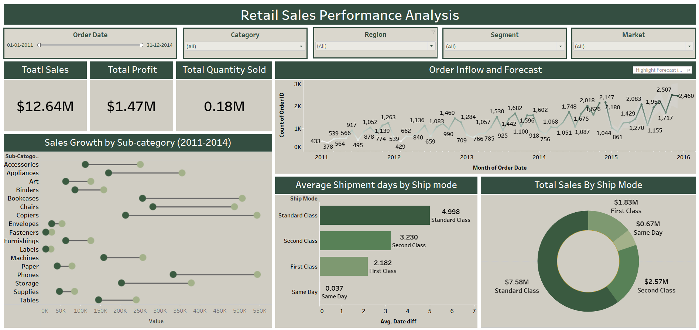
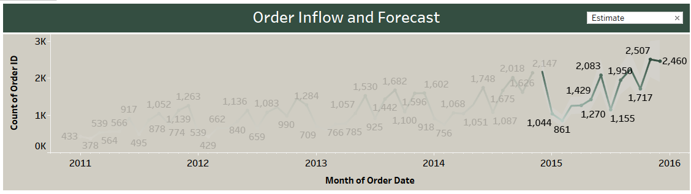
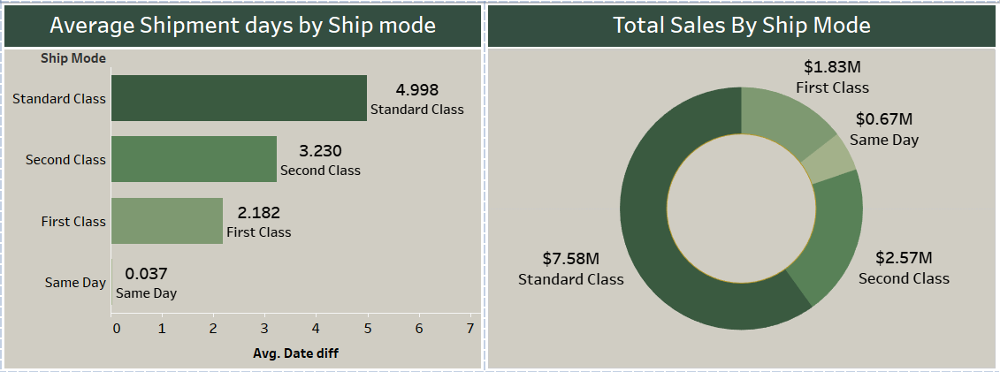
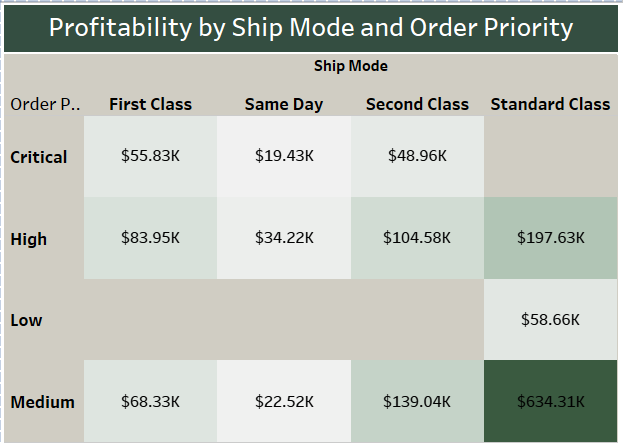
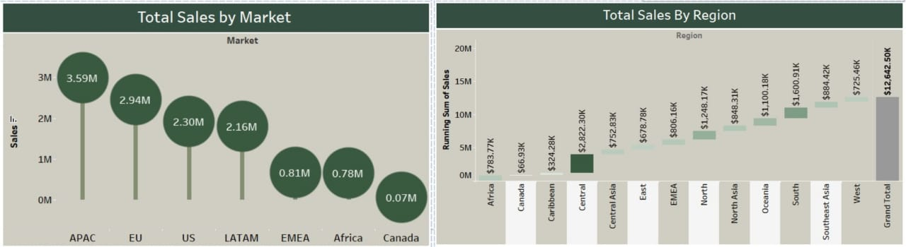

# Retail Sales Performance Analysis – Tableau Project

## Project Overview

Retail businesses thrive on understanding sales, profitability, customer segments, and logistics performance.  
This project uses **Tableau** to analyze a dataset, uncovering sales growth, profit drivers, shipment efficiency, and customer patterns.

The dashboard combines **interactive action filters** and a **Tableau story**, enabling users to explore key insights dynamically while following a guided narrative of business performance.

---

## Dataset

The data contains order-level details covering:

* **Orders:** Order ID, Order Date, Ship Date, Ship Mode, Order Priority  
* **Customers:** Customer ID, Name, Segment, Market, Region, Country  
* **Products:** Product ID, Category, Sub-Category, Product Name  
* **Metrics:** Sales, Quantity, Discount, Profit, Shipping Cost  

---

## Tools & Techniques

* **Tableau :** Dashboard + Story feature 
* **Visualization Types:** KPI cards, line charts with forecasting, barbell chart, heatmap, bar/column charts, waterfall chart  

---

## Key KPIs

* **Total Sales:** $12.64M  
* **Total Profit:** $1.47M  
* **Total Quantity Sold:** 0.18M  

---

## Insights & Analysis

**Order Trends & Forecasting**  

Orders consistently peaked in *December* and dipped in *February*, showing strong seasonality. For example, December 2013 recorded **1,682 orders**, while February 2012 saw just **429 orders**. Forecasting into 2015–2016 suggested that this upward trend would continue, with year-end remaining the busiest period.

**Sales Growth by Sub-Category** 

A **barbell chart** was used to show sales growth from 2011 to 2014. *Copiers* stood out, climbing from **$216K** in 2011 to **$550K** in 2014 — the strongest growth among sub-categories. At the other end, a few sub-categories showed only marginal increases, such as rising from **$13.6K** to **$25.8K** in the same period.

**Shipping & Logistics**

* *Standard Class* dominated sales (**$7.58M**) but averaged nearly **5 days** for delivery.  
* *First Class* was faster (**2.18 days**) yet contributed less revenue (**$1.83M**).  
* *Same Day* delivery was nearly instant (**0.03 days**) but accounted for only **$0.67M** in sales.  

The trade-off between speed and cost is clear: most customers favored Standard Class despite longer delivery times.

**Top Products**

* *Eldon File Cart* emerged as the highest ordered product, generating **$34.3K in sales** and a **$4.2K profit**.  
* In contrast, *Smead File Cart* ranked among the most ordered but ended in a **loss of $238**, showing that popularity does not always translate to profitability.

**Profit by Geography**

* The **United States** was the top performer with **$286K profit**.  
* *Turkey* reported the lowest performance at **–$98K**, suggesting challenges in pricing or operations.

**Market & Regional Breakdown**

* *APAC* contributed the highest sales (**$3.59M**)  
* *Canada* was the weakest market (**$0.07M**)  
* Regionally, the *Central region* topped sales at **$2.82M**, while Canada again remained at the bottom (**$66.9K**).

**Category-Wise Performance**

* *Technology* led with **$4.74M in sales**, reflecting strong demand for electronics and high-margin products that drive overall profitability.  
* *Furniture* contributed **$4.11M**, showing consistent demand, but slightly lower margins highlight opportunities for cost optimization or promotional focus.  
* *Office Supplies* generated **$3.79M**, proving to be the backbone for recurring revenue with steady profit margins.  

Overall, the category analysis tells a story of balancing high-value, fast-moving products (Technology) with stable, repeat-purchase items (Office Supplies) while optimizing margins in furniture.

**Profitability by Ship Mode & Order Priority**  
A heatmap revealed:

* *Standard Class + Medium Priority* drove the **highest profit ($634K)**.  
* *Same Day + Critical Priority* contributed the least (**$19K**).  
  Some combinations (e.g., First Class + Low Priority) showed negligible or no contribution.

**Customer Insights**

* *Bart Watters* stood out as the top customer with **$32.3K in sales**.  
* By sub-category, *Binders* recorded the highest order volume, while *Tables* had the lowest.

**Segment Performance**

* *Consumers:* $6.51M sales, $0.75M profit — clearly the largest contributor to revenue and profitability, representing individual buyers driving recurring purchases.  
* *Corporate:* $3.82M sales, $0.44M profit — accounts for large-volume orders with moderate profit margins, highlighting B2B opportunities.  
* *Home Office:* $2.31M sales, $0.25M profit — small but steady segment, offering growth potential with targeted campaigns.  

Segment analysis tells a story of prioritizing consumer demand while balancing corporate and home office opportunities for long-term growth.

---
## Download 

[Download the Tableau Workbook](Retail_Sales_Performance_Analysis.twbx)

## Screenshots

* **Dashboard Overview**  
  

* **Order Trends & Forecasting**  
  

* **Shipment Insights**
  
  

* **Market & Regional Insights**  
  

---

